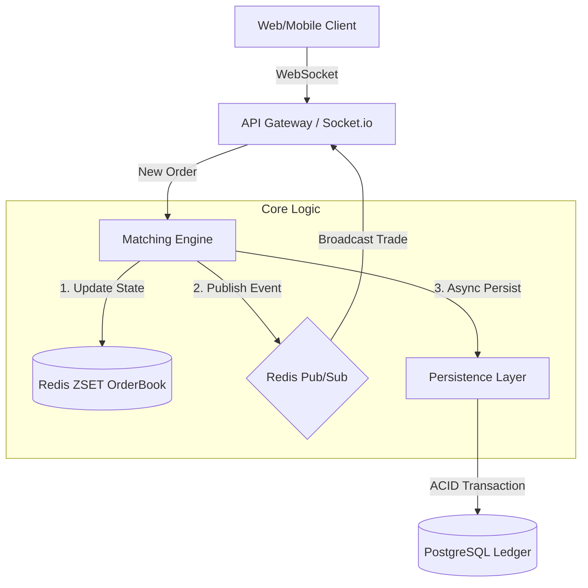
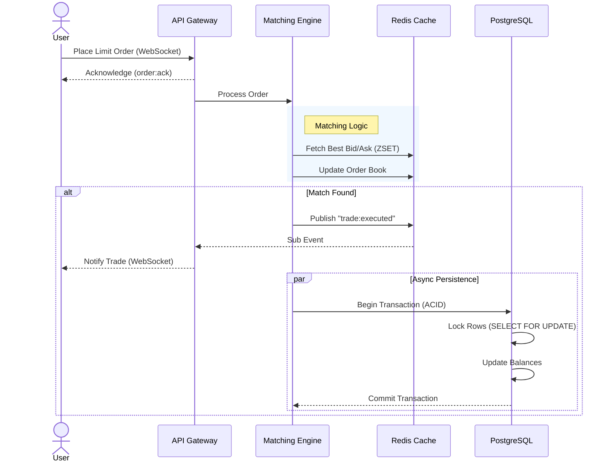

# Real-Time Crypto Exchange Engine


A high-performance, low-latency cryptocurrency trading engine built to demonstrate core concepts of high-frequency trading (HFT) systems. This project leverages in-memory data structures for O(log N) matching efficiency and ACID-compliant database transactions to ensure financial integrity.

## Executive Summary

This project implements a **Real-Time Crypto Exchange** matching engine capable of handling concurrent orders with sub-100ms latency. Unlike standard CRUD applications, this system prioritizes execution speed while solving distributed system challenges such as race conditions, double-spending prevention, and precision loss in financial calculations.

### Key Capabilities
- **High-Frequency Matching**: Utilizes Redis Sorted Sets to maintain a price-time priority order book.
- **ACID Integrity**: Implements `SELECT ... FOR UPDATE` row-level locking in PostgreSQL for secure fund transfers.
- **Real-Time Data Streaming**: Broadcasts trade executions immediately via WebSockets, decoupled from asynchronous persistence constraints.
- **Precision Math**: Eliminates floating-point errors by enforcing integer-based arithmetic (Satoshis/Cents) for all monetary values.

---

## Architecture

The system follows a modular architecture designed for horizontal scalability.



### Order Flow Sequence
The following diagram illustrates the lifecycle of an order, highlighting the **latency-optimized** path (WebSockets) versus the **durability** path (Database).



### Components

1.  **Matching Engine (`src/engine`)**
    -   The core processor. It maintains the state of the Order Book (Bids and Asks) using Redis Sorted Sets (ZSET).
    -   **Algorithm**: Standard Price-Time Priority (FIFO).
    -   **Optimization**: Composite scoring (`Score = Price + Timestamp`) allows Redis to sort orders natively by both price and arrival time in a single look-up.

2.  **Persistence Layer (`src/persistence`)**
    -   Handles the durability of trades and user balances.
    -   **Concurrency Control**: Uses Pessimistic Locking to serialize updates to the same wallet row, effectively preventing race conditions where two concurrent trades could spend the same funds.

3.  **Interface Layer (`src/interface`)**
    -   Manages WebSocket connections using `Socket.io`.
    -   Optimized for high throughput by offloading heavy processing to the Engine and strictly handling I/O.

---

## Design Decisions & Trade-offs

### 1. Redis ZSET vs. Native Arrays
*Decision*: Used Redis Sorted Sets instead of in-memory JavaScript arrays.
*Reasoning*: While JS arrays are faster for small datasets, Redis offers persistent, process-independent storage that allows the Matching Engine to scale horizontally or recover state after a crash.

### 2. Composite Scoring for FIFO
*Challenge*: Redis ZSETs sort by score (Price) but use lexicographical order for ties, which violates FIFO fairness.
*Solution*: Implemented a composite score algorithm.
- **Asks**: `Score = Price + (Timestamp / HighConstant)`
- **Bids**: `Score = Price + (MaxTimestamp - Timestamp) / HighConstant` (For Reverse Range sorting)
*Result*: Guaranteed O(log N) insertion and retrieval respecting strictly Fair Queueing.

### 3. Latency vs. Durability
*Constraint*: Writing every trade to Postgres synchronously adds 10-50ms latency per trade.
*Approach*: adopted a "Write-Behind" strategy for the project.
- **Execution**: Trades are executed in Memory/Redis and broadcasted immediately (<10ms).
- **Persistence**: Database updates happen asynchronously.
*Note*: In a production, high-value environment, this would be augmented with a Write-Ahead Log (WAL) or Kafka to ensure zero data loss in case of power failure.

---

## Getting Started

### Prerequisites
- Node.js v16+
- Docker (Optional, for running dependencies)
- Redis & PostgreSQL (Local installations required if not using Docker)

### Installation

1.  **Clone the Repository**
    ```bash
    git clone https://github.com/ishan1410/RTCrypto_Exchange.git
    cd RTCrypto_Exchange
    ```

2.  **Install Dependencies**
    ```bash
    npm install
    ```

3.  **Environment Configuration**
    Create a `.env` file based on your infrastructure:
    ```env
    PORT=3000
    DB_HOST=localhost
    DB_PORT=5432
    DB_USER=postgres
    DB_NAME=crypto_exchange
    REDIS_HOST=localhost
    REDIS_PORT=6379
    # MOCK_MODE=true # Enable if no local DB/Redis available
    ```

### Running the Engine

1.  **Initialize Database**
    ```bash
    # Ensure Postgres is running
    createdb crypto_exchange
    ```

2.  **Start Server**
    ```bash
    npx ts-node src/server.ts
    ```

3.  **Run Simulation**
    To verify the engine, run the included simulation script which seeds wallets and executes concurrent trades:
    ```bash
    # 1. Seed Wallets
    npx ts-node test/seed.ts
    
    # 2. Run Trading Bot
    npx ts-node test/simulation.ts
    
    # 3. Verify Ledger Integrity
    npx ts-node test/verify_db.ts
    ```

---

## 🚀 Performance Benchmarks

Stress testing performed on a local development environment (Node.js single thread) demonstrating high-throughput capabilities.

| Metric | Result | Notes |
| :--- | :--- | :--- |
| **Throughput** | **~4,600 Orders/sec** | Sustained burst of 1,000 orders |
| **Latency** | **< 1ms** | Network + Processing time (Localhost) |
| **DB Sync** | **Async/Non-blocking** | Zero impact on matching performance |

> **Note**: These results were achieved running the engine, Redis, and Postgres on the same machine. Production deployment on separated infrastructure would yield significantly higher throughput.

## 🧪 Verification Metrics

The system has been verified to handle the following scenarios:
- **Partial Fills**: Large orders consume multiple smaller liquidity providers.
- **Race Conditions**: Concurrent limit orders do not result in negative balances.
- **Precision**: 0.00000001 BTC is handled accurately without JS floating-point artifacts.

---

## License
MIT License.
